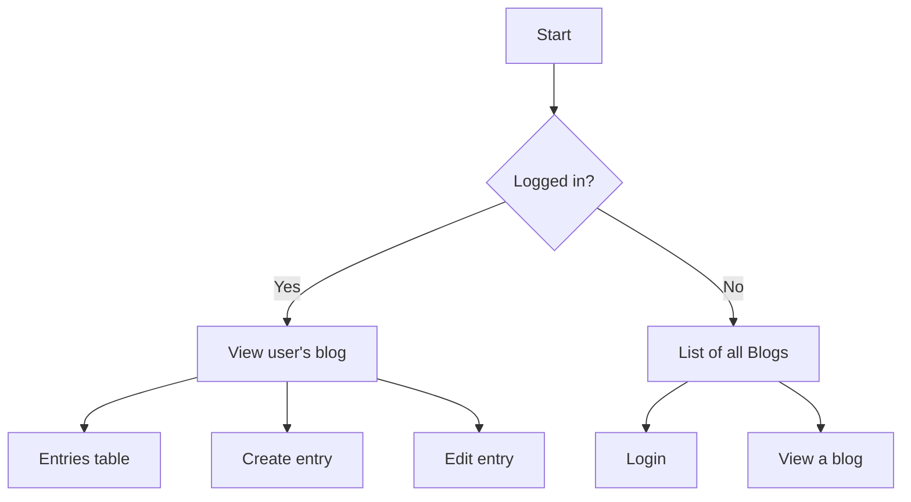

# README

Page flow

```mermaid
 flowchart TD;
     A[Start] --> B{Logged in?}  
     B --> |Yes| C[View user's blog]
     B --> |No| D[List of all Blogs]
     D --> F[Login]
     D --> G[View a blog]
     C --> H[Entries table]
     C --> I[Create entry]
     C --> J[Edit entry]
```
